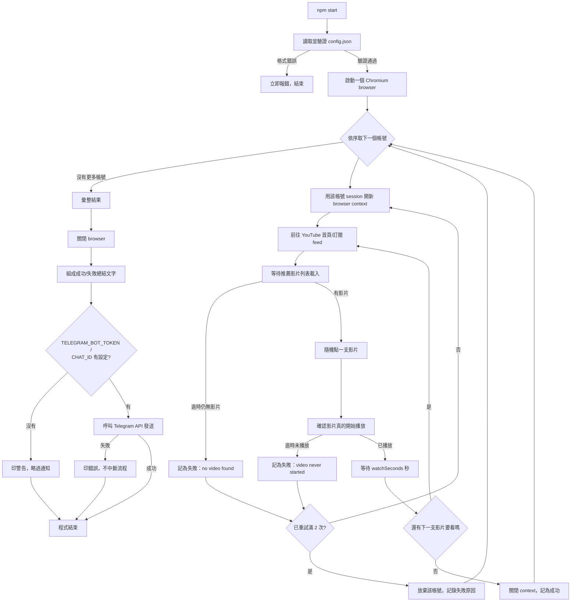

# youtube-auto-ip-geolocation

個人自動化腳本：用你自己保存的登入 session，依序登入多個 Google 帳號，各自到 YouTube 隨機挑一支推薦影片觀看約 10 秒，模擬簽到式觀看，可排程定時跑。完整規格見 `TICKET.md` 與 [issue #1](https://github.com/mao0507/youtube-auto-ip-geolocation/issues/1)。

**用途聲明**：純粹是個人帳號的自動化習慣，不是用來刷觀看數或影響他人頻道數據。

## 使用步驟（照順序做）

**1. 裝依賴**

```bash
npm install
npx playwright install chromium
```

**2. 設定 Telegram 通知（選填，但建議填）**

```bash
cp .env.example .env
```

編輯 `.env`，填入 `TELEGRAM_BOT_TOKEN` 跟 `TELEGRAM_CHAT_ID`。不填也能跑，只是跑完不會收到通知（程式會印警告後略過，不會報錯）。

**3. 設定 `config.json`**

- `headless`：是否顯示瀏覽器視窗（`false` 方便偵錯，`true` 排程無人值守用）
- `videosPerAccount`：每帳號看幾支影片
- `watchSeconds`：每支看幾秒，預設 10
- `accounts`：帳號清單，每筆是 `{ 代稱, session 檔路徑 }`

**4. 幫每個帳號存登入 session（每個帳號各做一次即可，之後不用再做）**

```bash
npm run login -- sessions/<帳號代稱>.json
```

會開一個瀏覽器視窗，你自己在裡面登入（含 2FA），登入完成後回終端機按 Enter，session 就存檔到指定路徑。這個路徑要跟 `config.json` 裡該帳號的 `sessionFile` 對上。

**5. 執行**

```bash
npm start
```

- 單一帳號登入或觀看失敗，會自動重試最多 2 次，仍失敗才跳過該帳號，不影響其他帳號繼續跑。
- 啟動時會先驗證 `config.json` 格式，欄位缺漏或型別錯會立刻報清楚的錯誤，不會等到跑到一半才炸。
- 全部帳號跑完後，會用 Telegram 發一則總結（哪些成功、哪些失敗與原因）。若 Telegram 本身連不上，只會記錄錯誤，不會讓整個執行判定失敗。

**6. （選用）排程無人值守執行**

把 `npm start` 排進 Windows 工作排程器，定時自動跑。前面 1–4 步都是一次性設定，排程只需要重複跑第 5 步。

## 程式內部執行邏輯

以下是 `npm start` 之後，程式本身怎麼跑，不是使用者要做的操作。



**文字版步驟**：

1. 讀 `config.json`，格式不對就直接報錯結束（不會跑到一半才發現）。
2. 開一個 Chromium browser，之後所有帳號共用這一個 browser process（各帳號用獨立 context 隔離，不用每帳號重開一個 browser）。
3. 依序處理每個帳號（不加延遲，跑完一個馬上跑下一個）：
   1. 用該帳號的 session 檔開一個新的 browser context + page。
   2. 進 YouTube 首頁/訂閱 feed，等待推薦影片縮圖出現。
   3. 隨機點一支影片。
   4. 確認影片「真的開始播放」（不是卡在緩衝/暫停），才開始計時 `watchSeconds` 秒。
   5. 依 `videosPerAccount` 設定重複步驟 ii–iv。
   6. 全部看完視為該帳號成功；中途任何一步失敗（找不到影片、播放沒啟動、session 失效等）視為該帳號本輪失敗。
   7. 若失敗，關掉這次的 context，整個流程重來（reuse 同一個 browser），最多重試到第 3 次嘗試；仍失敗就放棄該帳號、記下失敗原因，繼續下一個帳號。
4. 全部帳號跑完，關閉 browser，把每個帳號的成功/失敗狀況組成一段文字摘要，印在終端機。
5. 若 `.env` 有設 `TELEGRAM_BOT_TOKEN` 跟 `TELEGRAM_CHAT_ID`，把摘要發到 Telegram；沒設就印警告略過；發送失敗只記錯誤，不影響程式的結束狀態。

## 專案結構

- `src/runAccount.ts` — 單一帳號的核心流程（選影片、確認播放、觀看、重複）。這是測試接縫：測試時餵假的 `YoutubePage`，從不打真的 YouTube。
- `src/youtubePage.ts` — `YoutubePage` 介面 + 真正用 Playwright 操作瀏覽器的實作。
- `src/main.ts` — orchestrator：依序跑每個帳號、處理重試、最後發 Telegram 摘要。
- `src/login.ts` — 一次性的手動登入腳本，存出每個帳號的 session 檔。
- `src/config.ts` / `src/notify.ts` — config 讀取與驗證、Telegram 訊息組裝與發送。

## 測試

```bash
npm run typecheck
npm test
```
